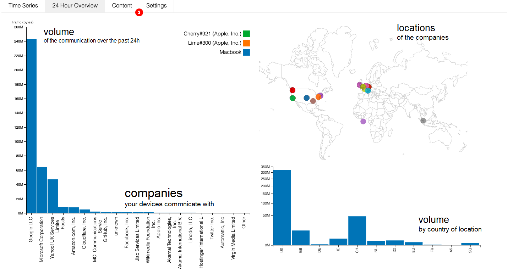

# Curriculum

## Question
- how do we assess prior knowledge and understanding?
-

# (1) Why do my devices communicate with different companies?
## Welcome!
By now you probably have plugged in a number of different devices, and you have observed how the Aretha interface shows data flows from connected devices.

You then probably clicked some of the company names to learn more about them, and you looked at the map to see where the companies are located

Looking at the map, you have probably also realised that every device you connected is sending data to more than on location (company), and maybe you've been wondering why that is the case, and how the receiving company might use the data.

Over the next few weeks, you will learn a little more about _**how these devices work**_, _**how data is collected and transferred**_, and _**how that data might be used**_.

## How are my devices connected to the internet?
Smart devices connect to the internet in different ways, actually. While some of them access the internet directly via WiFi or are connected via LAN, others synchronise via a mobile application that you install on your smart phone. Again other smart devices use a central hub to connect to the internet. Sounds confusing? Let's look at three different examples.

1) **Activity tracker** (e.g. Fitbit) -- assuming it doesn't Wifi or broadband, then the tracker will use Bluetooth to connect to an app on your phone; this app requests information from your trackers and uses your smartphone's broadband connection to transfer data to a remote server, e.g. Fitbit's server
activity tracker example: records information, transfers this to fitbit using a mobile app
2) **Smart TV** -- if you own a smart tv, then you probably remember connecting it to your LAN or Wifi; the smart TV will have different apps installed, just like your phone; and just like the apps on your phone, the apps on your smart tv will transfer data from different companies, e.g. Netflix, Amazon Prime, Now TV
3) **Smart outlet** - when you remotely switch the outlet on or off, the command to do so is (most likely) send over the internet. The outlet might be connect to your smart home hub using protocols like zigbee, and your smart home hub will be connected to the internet. When you use the smart outlet app on your phone to switch it on or off, the smart home hub will receive the command via its manufacturer's server, e.g. Samsung, and then forward this command to the outlet

## Why do my devices communicate with different companies?
On a smart TV, you would be logged into different 'apps', and these apps communicate with their provides: Amazon Prime Videos, Netflix, Now TV, BBC iPlayer and so on. Say it's a Samsung Smart TV. It might also share information with Samsung, such as your software version or any error reports. If you see some ads, then these ads might be loaded from another company all together.

The information smart device use and the information they collect are of particular importance to their manufacturers. There’s a lot of discussion about data collection, but little about why companies might want to collect data. Here are four of the main reasons, covering a broad range of applications.

1) **Service provision** - the most obvious reason for collecting data is that it’s needed in order to provide you with a service or to make recommendations to you (e.g. a company can’t charge you for something without your bank details, or suggest films without knowing what you like to watch)
2) **Advertising** - companies often include advertising code from other companies on their websites and apps in order to make ad revenue. This extra code often collects information about you and combines this with information from other sources in order to show you ads for products you’re more likely to click on and buy
3) **Product analytics** - companies often want to know which parts of their platforms are used the most. This is useful when improving the service they offer, as well as to help them market it more effectively to new customers
4) **Behavioural insights** - used to learn more about why users take particular actions, either to develop the product, improve marketing efforts, or tailor advertisements (e.g. analysing Alexa recording to create better speech recognition models)

#### Question
Please answer the following for any device connected to Aretha.

1) State which device you are talking about (with its name from the interface).
2) List the companies it communicates with and explain why it might be communicating with the respective company. Use any of the main reasons or add your own.

# (2) How do they connect through the internet?

## Recap
In the previous lesson, you've learned why your devices communicate with different companies. You've been introduced to four main reasons for companies to collected data: (1) service provisioning, (2) advertising, (3) product analytics, and (4) behavioural insights. We also asked you to explain why one of your devices sends data to different companies.

So far, we've looked at the internet as a black cloud (picture below). We know that transferring data from devices to companies uses the internet but we haven't looked at how that is actually accomplished. This lessons takes a closer look at what the internet acutally is and how it works.

## How do my devices connect to companies over the internet?
The internet is a global network of computers, some of which are called web servers. A web server is a computer which hosts websites for other computers to access over the internet. A web server may host a single website or many websites. Similarly, web servers also provide web services with which smart devices can communicate.

But how do you connect to a website? When you make a telephone call, a connection is formed between you and the person you are calling that goes through different telephone exchanges. Similarly, a connection between you and a web server will go through many different computers. A web server also needs to be able to connect to many different computers at the same time (like being on the phone with five people at once). Information sent between the web server and other computers is broken up into smaller chunks called data packets. Not only is it more efficient to route these smaller packets between computers, but it also saves time if one is lost and needs to be sent again.

<iframe height="315" src="https://www.youtube.com/embed/5o8CwafCxnU?start=0&amp;end=164&amp;controls=0" width="560"></iframe>

# (3) Why do some companies have locks next to their names?

## Recap
Devices connect to the internet either directly through Wifi or LAN, or they are connected using smartphones or smart home hubs. The internet is not just a cloud, but a network of networks in which devices can communicate with servers by exchanging packets of data. IP addresses are to route packets through the network.

## Why do some companies have locks next to their names?
Originally, information on the internet was sent in clear text. Informaion sent like this can be tampered with or spoofed by attackers (hackers). Many modern devices and services combat this by protecting your information using encryption.

### Encyrption
Secure protocols like Secure Socket Layer (SSL) or Transport Layer Security (TLS) protect your information by making it unreadable to hackers, like a secure layer wrapped around your data. This is what is happening when you see the padlock icon in your browser when acessing https:// sites.

### Authentication
The same protocols also verify the server certificate, making sure that the device is communicating with the correct server. With out this authentication, data might still be encrypted but you might unknowingly communicate with an imposter.

<iframe height="315" src="https://www.youtube.com/embed/kBXQZMmiA4s?start=281&amp;end=365&amp;controls=0" width="560"></iframe>

## Example
Not all of the data your devices are sending or receiving is encrypted. Encryption requires a lot of computation, which can be difficult for small devices, and adds complexity to communications. This is fine when the information being sent isn't sensitive, but can cause major problems otherwise.

For example, imagine a smart bathroom scale that sends data (hypothetically) to two different companies:
1) The manufacturer to store weight measurements
2) AccuWeather to request tomorrow's forecast

### Encryption
The weather forecast is fine to send unencrypted - there's little danger if anyone else is able to read them - but weight measurements from the bathroom scale reveal sensitive information about your current well-being and fitness level, as well as the time of the day at which you tend to use the scale. This information could be interesting for insurance companies or even burglars.

### Authentication
The weather forecast is probably equally fine to be send without authentication. Worst case, a wrong forecast would be displayed on the bathroom scale.
Sending your weight measurements to another server than the intended one, would be as dangerous as sending it unencrypted in the first place.

## Question
Please answer the following for any device connected to Aretha.

1) State which device you are talking about (with its name from the interface).
2) List the companies it communicates with, if the communication is encrypted, and explain why it might be communicating with the respective company. Use any of the main reasons or add your own.
3) For each company, what to do you think is their reason to use encryption?

# (4) But why does my data matter?
## Recap
In previous lessons, you have learned how your smart devices transfer data over the internet, and how companies might use that data. Reasons to collect and use data by companies included (1) service provisioning, (2) advertising, (3) product analytics, and (4) behavioural insights. We also asked you to explain why one of your devices sends data to different companies.

So what? Why does it matter that companies are collecting data? If it's for service provisioning or product analytics, then surely the user will benefit. If it's for advertising, then, well, we see adverts everyday anyway; and behavioural insights sound great; users could learn something interesting and improve their lives.

Let's take a step back and look at _**what data actually is**_, _**how it is collected across the internet**_, _**for what other purposes it might be used**_, and _**how valuable it may be**_.

## What is data, and why does it matter?
The fitibit will collect data about its user, e.g. heart rate, steps taken, sleep cycle, and other movements. It will use the data to gauge how fit the user is, and it might enquire via the fitbit server if the user is fitter than average. So far, so obvious to the user.

<iframe height="315" src="https://www.youtube.com/embed/_RVPj-GSOdY?controls=0" width="560"></iframe>

The information smart device use and the information they collect are of particular importance to their manufacturers. There’s a lot of discussion about data collection, but little about why companies might want to collect data. Here are four of the main reasons, covering a broad range of applications.

1) **Service provision** - the most obvious reason for collecting data is that it’s needed in order to provide you with a service or to make recommendations to you (e.g. a company can’t charge you for something without your bank details, or suggest films without knowing what you like to watch)
2) **Advertising** - companies often include advertising code from other companies on their websites and apps in order to make ad revenue. This extra code often collects information about you and combines this with information from other sources in order to show you ads for products you’re more likely to click on and buy
3) **Product analytics** - companies often want to know which parts of their platforms are used the most. This is useful when improving the service they offer, as well as to help them market it more effectively to new customers
4) **Behavioural insights** - used to learn more about why users take particular actions, either to develop the product, improve marketing efforts, or tailor advertisements (e.g. analysing Alexa recording to create better speech recognition models)

<iframe height="360" src="https://player.vimeo.com/video/334901208" width="640"></iframe>

## Question ??

TBD

# (5) So, how does 'advertising' work?
## Recap
Again, remember the different uses of data. One of them was advertising, and you probably have experienced some situations in which adverts felt awkwardly related to something you had searched for before. This lesson will explain how that might work in a little more detail.

## How does advertising work?
Advertising is the main business model financing media production on the open web, and the drive to increase revenue by targeting ads to selected users has led to the creation of a plethora of companies dedicated to monitoring our clicks, searches, and reading habits as we move around the Internet. These small amounts of information seem worthless on their own, but companies use them to build models about you that can infer your gender, ethnicity, religion, sexual preferences, and health. In many cases, these models are also used to predict when you’re going through major life events, such as graduation or pregnancy, as these are when you’re most vulnerable to the creation of new shopping habits.

<iframe height="315" src="https://www.youtube.com/embed/6EHSlhnE6Ck?controls=0" width="560"></iframe>

## Question
Please recall a situation in which you figured that you were presented with targeted adds.
Can you describe the situation? What kind of ads did you see?
How do you think were the ads chosen?
How did you feel and react in that situation?

# (6) Isn't that all a bit far fetched and theoretical?
## Recap
In the previous session, you have learned about how you can be tracked across different web sites and even different devices. You've also learned that this sometimes happens without the user noticing, and that protection against it is indeed really difficult.

## It sounds a bit surreal! Does it?

There are many sources of data collection in modern life - your computer and smartphone generate data about what you browse online and what you do with smartphone apps. While different sites and apps collect this data, it is often sold and shared as valuable information. In this way it gets combined with other data collected about you, as well as data from other people.

On their own, it might seem like these pieces of data are harmless. By itself, knowing that you buy coffee at the same time every weekend doesn’t give away much, but combined information from other people might tell someone who your friends are or that you practice a certain religion (e.g. visits to a cafe near a place of worship at the same times each week).

To illustrate the scale of data aggregation, Google receives data from around 90% of Android apps, and Facebook around 50%).

<iframe height="315" src="https://www.youtube.com/embed/mrnXv-g4yKU?controls=0" width="560"></iframe>

# (7) And how do data breaches fit in here?
## Recap
In the Cambridge Analytica example you have learned how data from different sources was combined to infer information about people. This information was ultimately used to target people with political messages. Cambridge Analytica had used data to come to the conclusion that these people were easy to influence, and therefore could be convinced to support the Trump campaign.

## What are data breaches?
It's disputed whether Cambridge Analytica was a data breach as the previous video discussed. This seems debatable. However, data is so valuable that people, so called hackers, try to obtain it illegally.

In reality, perfect security is impossible, and sometimes companies have customer information stolen in data breaches. This data can include information you gave them, like your name and address, but also information collected by your devices. Hackers will often collect lists of email addresses, usernames, and passwords from data breaches and try these credentials on other sites. If you use the same password in several different places, then this makes it easy for them to take over multiple accounts as soon as one is compromised.

Services like https://haveibeenpwned.com/ collate information on data breaches and let you check if any of your account details have been disclosed as part of a data breach. If a site or service that you use has been breached you should change your password on that site as soon as possible. If you use the same password anywhere else, change those as well - hackers will often try the same username/password combinations on several sites.

<iframe height="315" src="https://www.youtube.com/embed/0kK902-ZvNM?controls=0&amp;end=86" width="560"></iframe>

## Question
Recall any recent data breach you might have heard about.
From your memory, describe what happened.
Do you think you have been affected by a data breach? Try https://haveibeenpwned.com/ and tell us what you found out
Are you going to take any action?
