<!-- TOC depthFrom:1 depthTo:6 withLinks:1 updateOnSave:1 orderedList:0 -->

- [Intro -- What is Aretha?](#intro-what-is-aretha)
	- [S1: Aretha allows you to understand how data is flowing into and out of your home.](#s1-aretha-allows-you-to-understand-how-data-is-flowing-into-and-out-of-your-home)
	- [S1: Artha helps you understand how data is an integral part of smart home devices.](#s1-artha-helps-you-understand-how-data-is-an-integral-part-of-smart-home-devices)
	- [S2: Aretha allows you to control data flows.](#s2-aretha-allows-you-to-control-data-flows)
	- [S2: Aretha helps you to understand your data rights!](#s2-aretha-helps-you-to-understand-your-data-rights)
	- [S3: Content: What does Aretha show?](#s3-content-what-does-aretha-show)
		- [Example: How can I use it?](#example-how-can-i-use-it)
- [Learning -- Basics](#learning-basics)
	- [B1: Content: What is the internet? {#what}](#b1-content-what-is-the-internet-what)
		- [Video](#video)
	- [B2: How does it work?](#b2-how-does-it-work)
	- [B3: Content-1: What is the world-wide-web? {#www}](#b3-content-1-what-is-the-world-wide-web-www)
		- [Content: World-Wide-Web](#content-world-wide-web)
			- [Video](#video)
	- [B3a-optional: Content: Content Delivery Networks](#b3a-optional-content-content-delivery-networks)
	- [B4: Content: What is data encryption? {#encryption}](#b4-content-what-is-data-encryption-encryption)
		- [Videos](#videos)
		- [Optional: What is encryption cont'd?](#optional-what-is-encryption-contd)
		- [Example: Not all traffic is encrypted](#example-not-all-traffic-is-encrypted)
- [Learning -- Data](#learning-data)
	- [D0: Content: Data use](#d0-content-data-use)
	- [D1: Content: Cookies, Tracking and Advertising](#d1-content-cookies-tracking-and-advertising)
		- [Video](#video)
		- [Example:](#example)
	- [D2: Content: Inference and combination](#d2-content-inference-and-combination)
		- [Example: Cambrdige Analytica](#example-cambrdige-analytica)
	- [D3: Content: Data breaches](#d3-content-data-breaches)
		- [Example:](#example)
- [Learning -- Smart Devices](#learning-smart-devices)
	- [SD1: Content: How smart devices work?](#sd1-content-how-smart-devices-work)
		- [Example: Smart Bathroom Scale](#example-smart-bathroom-scale)
- [Learning -- Controls](#learning-controls)
	- [C1: Content: Aretha data flow policy](#c1-content-aretha-data-flow-policy)
	- [Example: Blocking traffic to ads.ad](#example-blocking-traffic-to-adsad)
	- [C2: Content: Your rights](#c2-content-your-rights)
		- [Right to be informed](#right-to-be-informed)
		- [Data copy](#data-copy)
		- [Accuracy & deletion](#accuracy-deletion)
		- [Use limitation](#use-limitation)
- [Evaluation](#evaluation)
	- [Internet Basics](#internet-basics)
		- [Pre-lessons](#pre-lessons)
			- [Please describe briefly what the internet is and how it works. (150 words)](#please-describe-briefly-what-the-internet-is-and-how-it-works-150-words)
			- [Internet know-how self report scale (5-point measuring familiarity), inspired by [1].](#internet-know-how-self-report-scale-5-point-measuring-familiarity-inspired-by-1)
		- [Post-lessons](#post-lessons)
			- [Revisit initial statement](#revisit-initial-statement)
			- [What do you think about these sketches?](#what-do-you-think-about-these-sketches)
	- [Data](#data)
		- [Pre-lessons](#pre-lessons)
			- [Please describe briefly how you generate data online and how your data is being used.](#please-describe-briefly-how-you-generate-data-online-and-how-your-data-is-being-used)
			- [Data know-how self report scale (5-point measuring familiarity), inspired by [1].](#data-know-how-self-report-scale-5-point-measuring-familiarity-inspired-by-1)
		- [Post-lessons](#post-lessons)
			- [Revisit initial statement](#revisit-initial-statement)
			- [What do you think about these sketches?](#what-do-you-think-about-these-sketches)
	- [Smart Devices](#smart-devices)
		- [After seeing the video and in your own words, how does Amazon Alexa work (150 words)](#after-seeing-the-video-and-in-your-own-words-how-does-amazon-alexa-work-150-words)

<!-- /TOC -->

**WORKING**  -->
[_**Onlinesurvey**_](https://admin.onlinesurveys.ac.uk/account/oxford/survey/edit/492166)

page | content | example | comment
---- | ------ | ----- | ----
S1  |  review | none |
S2 | edit  |   tbd | @Will screenshot?
S3  | edit  | tbd  | @Will
B1  | review  | none |
B2   | review  | none  |
B3   | review  | none  |
B3a-optional | review  |   tbd | @Will
B4 | review  |    review |
SD1  | review  | edit | @Will screenshot, rework?
D0  | review  | none |
D1  | review  | tbd |
D2  |  review  | review |
D3  | review  | tbd |
C1   | review  | edit  |
C2   | review  | none  |
-------|-------|-------|-------
EVAL B   | tbd  |   | based on [^1]
EVAL SD   |  tbd |   | TBD
EVAL D   | tbd  |   | based on [^2]
EVAL C   | tbd  |   | TBD

[^1]: Kang, R., Dabbish, L., Fruchter, N., & Kiesler, S. (2015). “My data just goes everywhere”: User mental models of the internet and implications for privacy and security. In Symposium on Usable Privacy and Security (SOUPS) 2015 (pp. 39–52).

[^2]: Yao, Y., Lo Re, D., & Wang, Y. (2017). Folk Models of Online Behavioral Advertising, 1957–1969. https://doi.org/10.1145/2998181.2998316

# Intro -- What is Aretha?
`MK: I imagine this to be motivation, background and feature overview of Aretha. This will be the first thing participants see after startup.`
## S1: Aretha allows you to understand how data is flowing into and out of your home.
- Data flows when you use an app on your smartphone, load a website on your computer, upload activities from your Fitbit, or remotely switch on the heating.
- Connect any devices (or many) to Aretha's WiFi hotspot to start investigating your data streams.
- You can review data flows over time, zooming into which devices communicated with which destinations.
<iframe width="560" height="315" src="https://www.youtube.com/embed/_RVPj-GSOdY?controls=0" frameborder="0" allow="accelerometer; autoplay; encrypted-media; gyroscope; picture-in-picture" allowfullscreen></iframe>

## S1: Artha helps you understand how data is an integral part of smart home devices.
- All of your devices send and receive data when you use them actively.
- Devices might also send and receive data when they are 'waiting'.
- Manufacturers use data to provide features, monitor the device status, and for many more things.
<iframe title="vimeo-player" src="https://player.vimeo.com/video/334901208" width="640" height="360" frameborder="0" allowfullscreen></iframe>

## S2: Aretha allows you to control data flows.
- You can decide which servers your devices are allowed to communicate with (caveat: this might curtail functionality).

## S2: Aretha helps you to understand your data rights!
Source: [Your data matters](https://ico.org.uk/your-data-matters/)
- Your right to be informed if your personal data is being used
- Your right to get copies of your data
- Your right to get your data corrected
- Your right to get your data deleted
- Your right to limit how organisations use your data
- Your right to data portability
- The right to object to the use of your data
- Your rights relating to decisions being made about you without human involvement
- Your right to access information from a public body
- Your right to raise a concern

## S3: Content: What does Aretha show?
The main aretha screen consists of three separate graphs:
1) a time series chart that includes all devices
2) a world map with dots that mark destinations (companies) with which each device communicates at a given point in time
3) a bar chart that displays how much data for a specific device is being sent to or received from different locations

### Example: How can I use it?
Now, there are a number of ways you can interact with the information.
- using the time slider, you can define the time window for the time series graph
- clicking any of the dots on the world map will display information on the entity (company/service) which is located there
- clicking any of the bars you can learn about the underlying data
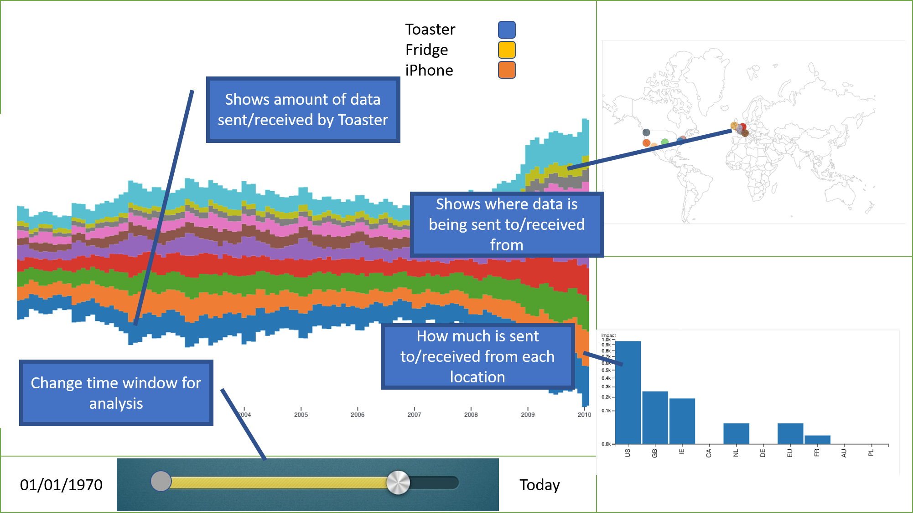

# Learning -- Basics
## B1: Content: What is the internet? {#what}

Source: [BBC Bitesize KS3 -- Internet and Communication](https://www.bbc.com/bitesize/guides/z8nk87h/revision/1)

The internet has revolutionised the way we work and play. It allows us to communicate, to share data and to seek information in a matter of seconds. All this is possible through the use of computers and networks.

The internet is a global network of computers. All computer devices (including PCs, laptops, games consoles and smartphones) that are connected to the internet form part of this network. Added together, there are billions of computers connected to the internet, all able to communicate with each other.

Today, the internet is a massive part of our daily lives.

### Video
[What is the internet?](https://www.youtube.com/watch?v=Dxcc6ycZ73M&list=PLzdnOPI1iJNfMRZm5DDxco3UdsFegvuB7) | 3:44  | entry | 1) internet as network; 2) who's in charge; 3) opportunity for people

<iframe width="560" height="315" src="https://www.youtube.com/embed/Dxcc6ycZ73M?controls=0" frameborder="0" allow="accelerometer; autoplay; encrypted-media; gyroscope; picture-in-picture" allowfullscreen></iframe>

## B2: How does it work?
Source: [BBC Bitesize KS3 -- Internet and Communication](https://www.bbc.com/bitesize/guides/z8nk87h/revision/1)

The internet is a global network of computers, some of which are called web servers. A web server is a computer which holds websites for other computers linked to the internet to access. Holding a website is known as ‘hosting’. A web server may host one or many websites and webpages. Sending information to a web server is known as uploading. Receiving information from a web server is known as downloading.

When you make a telephone call, a direct connection is formed between you and the person you are calling. While you are making the call, no-one else can communicate with you. A web server needs to be able to communicate with many different computers at the same time. When information is uploaded to, or downloaded from, a web server it is broken up into tiny pieces called data packets. Each packet is a very short communication between the client computer and the web server. Because each communication lasts only milliseconds, the web server can seemingly communicate with many computers at the same time. It is a bit like having several conversations at the same time, but only saying one word to each person in turn.

[The Internet: IP Addresses & DNS](https://www.youtube.com/watch?v=5o8CwafCxnU&list=PLzdnOPI1iJNfMRZm5DDxco3UdsFegvuB7&index=3)  | 0:00-2:44 basics  | entry  | IP addresses and message exchange
<iframe width="560" height="315" src="https://www.youtube.com/embed/5o8CwafCxnU?start=0&end=164&controls=0" frameborder="0" allow="accelerometer; autoplay; encrypted-media; gyroscope; picture-in-picture" allowfullscreen></iframe>

## B3: Content-1: What is the world-wide-web? {#www}
Source: [BBC Bitesize KS3 -- Internet and Communication](https://www.bbc.com/bitesize/guides/z8nk87h/revision/1)
### Content: World-Wide-Web
The internet is a global network of computers. The World Wide Web is the part of the internet that can be accessed through websites. Websites consist of webpages which allow you to see information.

Websites are accessed using a web browser. A browser is a program designed to display the information held on a website. Every website has an address at which it can be found, a bit like a house address.

A website’s address is known as its URL. A website can be visited by typing its URL into a web browser. Each address contains the prefix 'http:' which tells the computer to use the hyper text transfer protocol for communicating with the website. The browser then connects to the internet, finds the website at its address and downloads the information stored there onto our computer for us to view.

Websites and webpages are joined together using hyperlinks. Clicking on a hyperlink takes us to another site or page.

#### Video
[The internet: HTTP & HTML](https://www.youtube.com/watch?v=kBXQZMmiA4s&list=PLzdnOPI1iJNfMRZm5DDxco3UdsFegvuB7&index=5)  | 0:29- 4:40 | internmediate  | 1) HTTP as language PCs communicate in; 2) HTML as description of websites; websites include more than one request; 3) sending data and cookies
<iframe width="560" height="315" src="https://www.youtube.com/embed/kBXQZMmiA4s?controls=0&start=29&end=280" frameborder="0" allow="accelerometer; autoplay; encrypted-media; gyroscope; picture-in-picture" allowfullscreen></iframe>

## B3a-optional: Content: Content Delivery Networks
In order to provide services across the internet, a certain amount of bandwidth is needed in order to transfer content. Sometimes, in order to ensure smooth delivery of films, music, or other media, companies partner with dedicated firms called content delivery networks, or CDNs.
This means that when you use Aretha, you might see one of these networks appear when you weren’t expecting it - for example, when watching Netflix you might see traffic in Aretha from Fastly, a popular CDN.

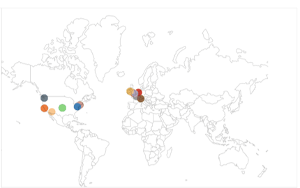

## B4: Content: What is data encryption? {#encryption}
Source: [BBC Bitesize KS3 -- Internet communication](https://www.bbc.com/bitesize/clips/z2vkwmn)
Encryption is used to scramble information so that it can be sent safely without anyone else being able to read it. The information is encrypted with a password or key that is needed to read the information again. If you visit a website on the internet that starts with 'https://' then this means that all of the information you are looking at or sending is being securely encrypted. One of the oldest methods of encryption is the caesar cipher. This works by shifting each letter of the message forward a specific number of paces in the alphabet. To read the message you need to know how many places each letter was moved (this is called the key).

### Videos
[The Internet: HTTP & HTML](https://www.youtube.com/watch?v=kBXQZMmiA4s&list=PLzdnOPI1iJNfMRZm5DDxco3UdsFegvuB7&index=5)  | 4:41- 6:05 | intermediate  | 1) data encryption TLS & SSL; 2) certificates
<iframe width="560" height="315" src="https://www.youtube.com/embed/kBXQZMmiA4s?start=281&end=365&controls=0" frameborder="0" allow="accelerometer; autoplay; encrypted-media; gyroscope; picture-in-picture" allowfullscreen></iframe>

### Optional: What is encryption cont'd?
[The Internet: Encryption & Public Keys](https://www.youtube.com/watch?v=ZghMPWGXexs&list=PLzdnOPI1iJNfMRZm5DDxco3UdsFegvuB7&index=6)  | 6:39   | advanced | 1) ecnryption/decryption 2) caesar cipher 3) asymmetric encryption 4) security protocols

<iframe width="560" height="315" src="https://www.youtube.com/embed/ZghMPWGXexs?controls=0" frameborder="0" allow="accelerometer; autoplay; encrypted-media; gyroscope; picture-in-picture" allowfullscreen></iframe>

### Example: Not all traffic is encrypted
Not all of the data your devices are sending or receiving is encrypted. There's a reason for that. Encryption is 'expensive', resource intense for small computer chips like in bathroom scales. Is that a problem?
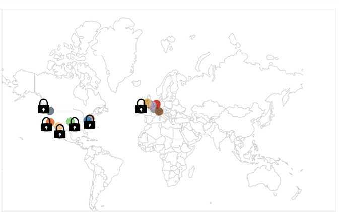

# Learning -- Data
## D0: Content: Data use
<iframe width="560" height="315" src="https://www.youtube.com/embed/_RVPj-GSOdY?controls=0" frameborder="0" allow="accelerometer; autoplay; encrypted-media; gyroscope; picture-in-picture" allowfullscreen></iframe>

The information smart device use and the information they collect are of particular importance to their manufacturers. There’s a lot of discussion about data collection, but little about why companies might want to collect data. Here are four of the main reasons, covering a broad range of applications.
1) Service provision - the most obvious reason for collecting data is that it’s needed in order to provide you with a service (e.g. a company can’t charge you for something without your bank details, or recommend you films without knowing what you like to watch)
2) Advertising - companies often include advertising code from other companies on their websites and apps in order to make ad revenue. This extra code often collects information about you and combines this with information from other sources in order to show you ads for products you’re more likely to click on and buy
3) Product analytics - companies often want to know which parts of their platforms are used the most. This is useful when improving the service they offer, as well as to help them market it more effectively to new customers
4) Behavioural insights - used to learn more about why users take particular actions, either to develop the product, improve marketing efforts, or tailor advertisements (e.g. analysing Alexa recording to create better speech recognition models)

<iframe title="vimeo-player" src="https://player.vimeo.com/video/334901208" width="640" height="360" frameborder="0" allowfullscreen></iframe>

## D1: Content: Cookies, Tracking and Advertising
Source: [BBC WebWise](http://www.bbc.co.uk/webwise/guides/about-cookies)
**Advertising** is the main business model financing media production on the open web, and the drive to increase revenue by targeting ads to selected users has led to the creation of a plethora of companies dedicated to monitoring our clicks, searches, and reading habits as we move around the Internet.
These small amounts of information seem worthless on their own, but companies use them to build models about you that can infer your gender, ethnicity, religion, sexual preferences, and health. In many cases, these models are also used to predict when you’re going through major life events, such as graduation or pregnancy, as these are when you’re most vulnerable to the creation of new shopping habits.

### Video
[Understanding Digital Tracking](https://www.youtube.com/embed/6EHSlhnE6Ck?controls=0) | 2:18 | cookie tracking across sites, digital profiles, probabilistic matching for devices, privacy concerns: insurance coverage, draw backs and counter measures (short), benefits of digital tracking (open ended)
<iframe width="560" height="315" src="https://www.youtube.com/embed/6EHSlhnE6Ck?controls=0" frameborder="0" allow="accelerometer; autoplay; encrypted-media; gyroscope; picture-in-picture" allowfullscreen></iframe>

### Example:

## D2: Content: Inference and combination
Sources: [ft.com](https://ig.ft.com/mobile-app-data-trackers/)

There are many sources of data collection in modern life - your computer and smartphone generate data about what you browse online and what you do with smartphone apps. While different sites and apps collect this data, it is often sold and shared as valuable information. In this way it gets combined with other data collected about you, as well as data from other people.

On their own, it might seem like these pieces of data are harmless. By itself, knowing that you buy coffee at the same time every weekend doesn’t give away much, but combined information from other people might tell someone who your friends are or that you practice a certain religion (e.g. visits to a cafe near a place of worship at the same times each week).

To illustrate the scale of data aggregation, Google receives data from around 90% of Android apps, and Facebook around 50%).

Of the <n> devices connected to Aretha, <x> of them send data to Google or Facebook.

### Example: Cambrdige Analytica
Source: [New York Times via YouTube](https://www.youtube.com/watch?v=mrnXv-g4yKU) | 2:32 | story, was it a data breach?
<iframe width="560" height="315" src="https://www.youtube.com/embed/mrnXv-g4yKU?controls=0" frameborder="0" allow="accelerometer; autoplay; encrypted-media; gyroscope; picture-in-picture" allowfullscreen></iframe>

## D3: Content: Data breaches
Source: [NCSC](https://www.ncsc.gov.uk/section/information-for/individuals-families)

In reality, perfect security is impossible, and sometimes companies have customer information stolen in data breaches. This data can include information you gave them, like your name and address, but also information collected by your devices.
Hackers will often collect lists of email addresses, usernames, and passwords from data breaches and try these credentials on other sites. If you use the same password in several different places, then this makes it easy for them to take over multiple accounts as soon as one is compromised.
Services like https://haveibeenpwned.com/ collate information on data breaches and let you check if any of your account details have been disclosed as part of a data breach

[The Danger of a Data Breach -- Kaspersky](https://www.youtube.com/embed/0kK902-ZvNM) | 2:00 |  data protection, data breaches on the rise, threats (bank account, identity theft, black mail, malware), targets (individuals, companies), counter measures (change passwords, password manager, protect information in cloud, back ups)
<iframe width="560" height="315" src="https://www.youtube.com/embed/0kK902-ZvNM?controls=0" frameborder="0" allow="accelerometer; autoplay; encrypted-media; gyroscope; picture-in-picture" allowfullscreen></iframe>

<company>, which communicates with your <device> was the victim of a data breach on <date>, where hackers retrieved <data>

### Example:

# Learning -- Smart Devices
## SD1: Content: How smart devices work?
Have you ever wondered what actually happens when you talk to a device like Amazon Alexa? The video illustrates how the device processes your questions to come up with an answer.

[How smart devices actually work](https://player.cnbc.com/p/gZWlPC/cnbc_global?playertype=synd&byGuid=3000625364) | 1:44 | Amazon Echo example
<iframe width=560 height=349 src=https://player.cnbc.com/p/gZWlPC/cnbc_global?playertype=synd&byGuid=3000625364 frameborder=0 scrolling=no ></iframe>

Alexa uses complex algorithms are used to search the web and databases for answers. Alexa sends requests to different data sources to answer your questions. This is similar to loading a web page where you might load pictures from different resources than text.

### Example: Smart Bathroom Scale
It's actually not all that different for other smart devices. Let's look at a smart bathroom scale, for example. Let's assume the picture showed data send from the scale in red, and data requested by the scale in blue. Then let's assume the scale was sending your daily weight information to New York, some logging infomration (e.g. when you used the scale) to a place in Colorado, and the scale was requesting weather data from California and asked for software updates in Idaho. Sometimes this communication might be bi-directional. Let's assume the scale could show a monthly summary of its measurements, e.g. how your body weight changed relatively to your body fat. It would request this information from the same server where it sent the measurements.
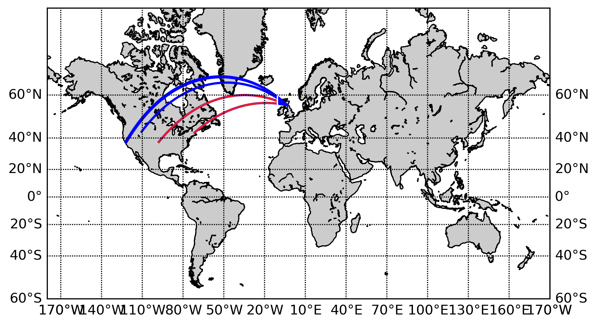
**_TO BE replaced with ARETHA example_**

# Learning -- Controls
## C1: Content: Aretha data flow policy
Aretha allows you to block or unblock data flows for specific destinations and/or devices.
Blocking traffic might change the behaviour of your device or curtail its functionality.
If you decide to block data traffic with a specific destination, make sure to test your device is still working properly.

## Example: Blocking traffic to ads.ad

## C2: Content: Your rights
As part of the transparency principle of data protection law, you have a number of rights that you can exercise over companies that have collected data about you

### Right to be informed
You have a right to be informed if your personal data is being used. This is normally provided in a privacy policy given to you when you sign up for a product or service.

### Data copy
You can get a copy of any data that a company holds about you.

### Accuracy & deletion
If the data held about you is inaccurate, you have the right to get it corrected. If you no longer want the company to store your data, you have the right to have that data deleted.

### Use limitation
To limit or prevent organisations using your data for certain purposes (like direct marketing). You can also prevent companies making automated decisions about you.

# Evaluation
## Internet Basics
> In sum, there is mixed and indirect evidence of whether or not an accurate mental model and more advanced Internet knowledge are associated with more secure online behavior. In light of the new data privacy and security challenges associated with the Internet’s evolution, we wanted to assess how people currently understand the Internet, their perceptions of how their data flows on the Internet, and what they are currently doing to protect their privacy or data security. Our work aims to examine the relationship between people’s knowledge and their privacy and security behavior in today’s Internet environment, and to move towards a better understanding of the kinds of Internet knowledge users need to have. -- [1]

> Lay people, as compared to those with computer science or related backgrounds, had simpler mental models that omitted Internet levels, organizations, and entities. People with more articulated technical models perceived more privacy threats, possibly driven by their more accurate understanding of where specific risks could occur in the network. Despite these differences, we **_did not find a direct relationship between people’s technical background and the actions they took to control their privacy or increase their security online_** -- [1]

> participants expressed a great deal of uncertainty or lack of knowledge about how the Internet works, how their data is collected, shared or stored, what protective actions they could use, and _**whether the protection is effective or not**_. -- [1]

### Pre-lessons

Assess users' prior understanding of the internet.
#### Please describe briefly what the internet is and how it works. (500 characters)

#### Internet know-how self report scale (5-point measuring familiarity), inspired by [1].

Scale:
1) I've never heard of this.
2) I've heard of this but I don't know what it is.
3) I know what this is but I don't know how it works.
4) I know generally how this works.
5) I know very well how this works.

Terms (taken from curriculum):
- World wide web
- Web sites
- Unique resource locator (URL)
- Hyper Text Transfer Protocol (HTTP)
- Hyper Text Markup Language (HTML)
- message exchange (e.g. HTTP requests)
- IP addresses
- cookies
- encryption
- certificates

### Post-lessons
#### Revisit initial statement
> #### Please describe briefly what the internet is and how it works. (150 words)

#### What do you think about these sketches?
The pictures were drawn by people like you and me who were asked how they understood online data collection and tracking. We are interested in what you think about these sketches. Please comment briefly (50 words) on each of them.

_**Hint:**_ There's no right or wrong.

Source: [1]
1) 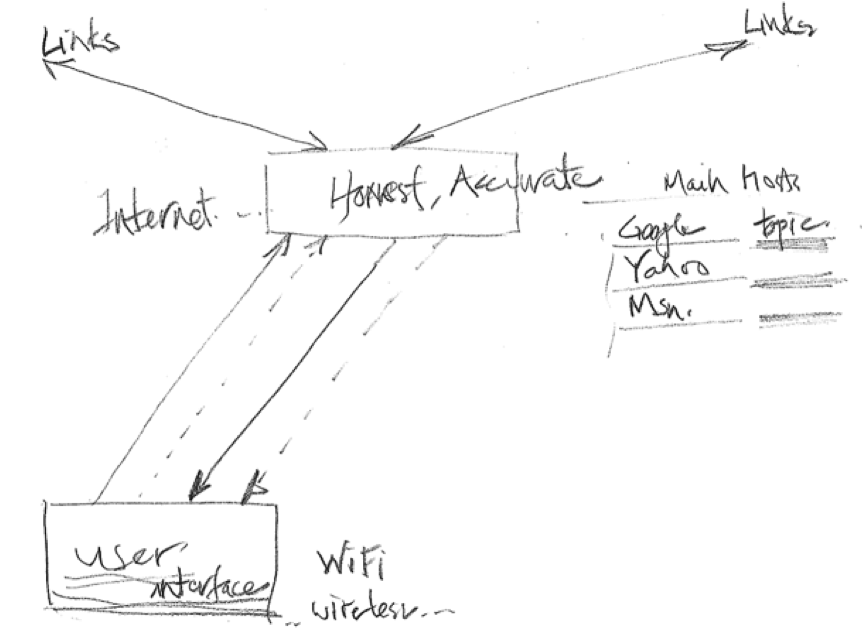
2) 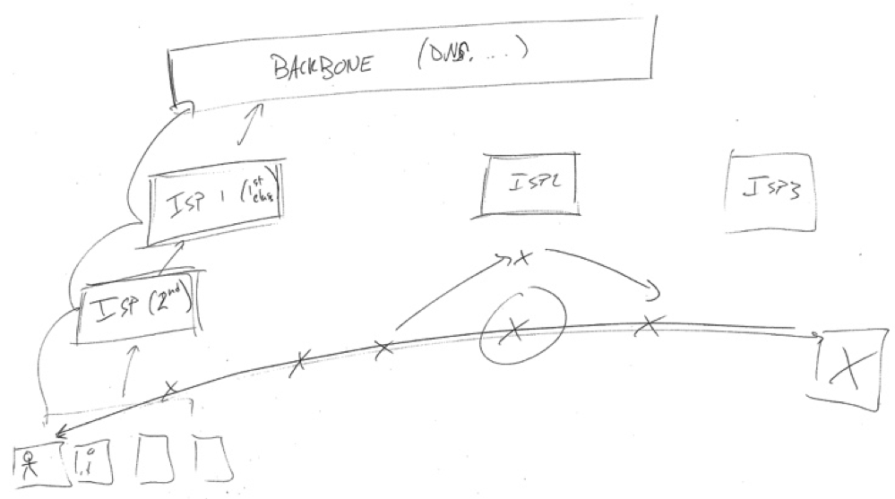
3) 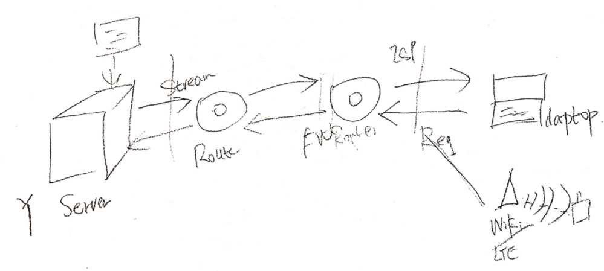

[1] Kang, R., Dabbish, L., Fruchter, N., & Kiesler, S. (2015). “My data just goes everywhere”: User mental models of the internet and implications for privacy and security. In Symposium on Usable Privacy and Security (SOUPS) 2015 (pp. 39–52).

## Data

### Pre-lessons

#### Please describe briefly how you generate data online and how your data is being used (500 characters).

#### Data know-how self report scale (5-point measuring familiarity), inspired by [1].

Scale:
1) I've never heard of this.
2) I've heard of this but I don't know what it is.
3) I know what this is but I don't know how it works.
4) I know generally how this works.
5) I know very well how this works.

Terms (taken from curriculum):
- data uses
  - service provision
  - advertising
  - analytics
  - behavioural insights
- digital tracking/profiles
  - draw backs of tracking
  - benefits of tracking
- data inference and combination
- data breaches

### Post-lessons
#### Revisit initial statement
> #### Please describe briefly how you generate data online and how your data is being used.

#### What do you think about these sketches?
The pictures were drawn by people like you and me who were asked how they understood online data collection and tracking. We are interested in what you think about these sketches. Please comment briefly (50 words) on each of them.

_**Hint:**_ There's no right or wrong.

Source: [2]
1) Browser-pull model: an example from P9. When a user searches for a pair of shoes on Amazon, the web browser will save the search information. The web browser has contracted with Amazon. When the user visits Facebook, the browser will pull the saved infor- mation and display ads for Amazon on the user’s Facebook page.
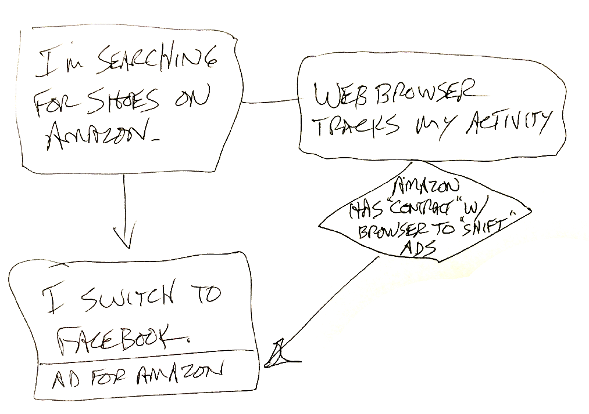
2) First-party-pull model: an example from P16. He searches shoes on Amazon, then the browser stores the action in the cache; later, he visits Facebook, which then goes to its advertising server, and bids ads with the cached user information using a bidding algorithm. Facebook then displays the ads on his Facebook page.
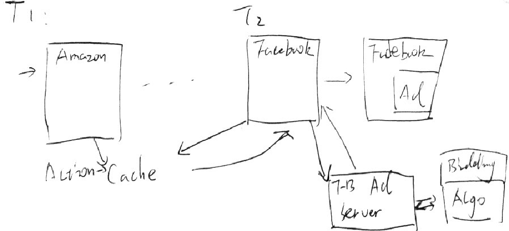
3) Connected-first-party model: an example from P6. When she searches shoes on Amazon, Amazon saves the search information. Amazon sells the data to Facebook (indicated by a dollar sign at the bottom left of the Facebook box). Facebook then gets more money from “other shoe” companies (two dollar signs) to show the shoe ads on her Facebook. The CEOs of Amazon and Facebook under the sun would not share her data if it is not for money.
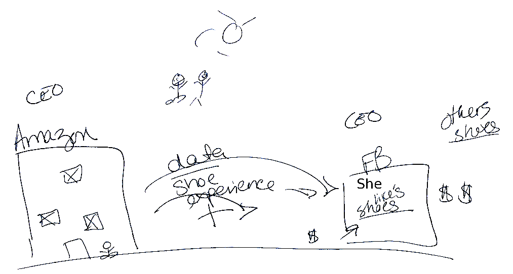
4) Third-party model: an example from P4. When a user searches shoes on Amazon, Amazon collects the user’s data and then transmits the data to an Internet space. This Internet space sends ads to Facebook, which will display the shoe ads on the user’s Facebook.
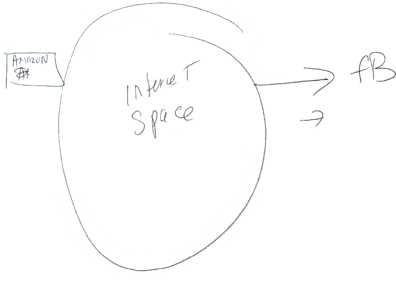

[2] Yao, Y., Lo Re, D., & Wang, Y. (2017). Folk Models of Online Behavioral Advertising, 1957–1969. https://doi.org/10.1145/2998181.2998316

## Smart Devices

### After seeing the video and in your own words, how does Amazon Alexa work (150 words)
